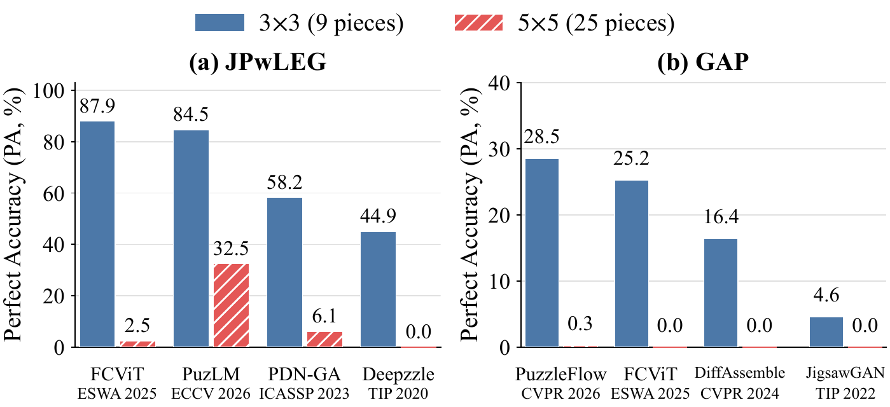
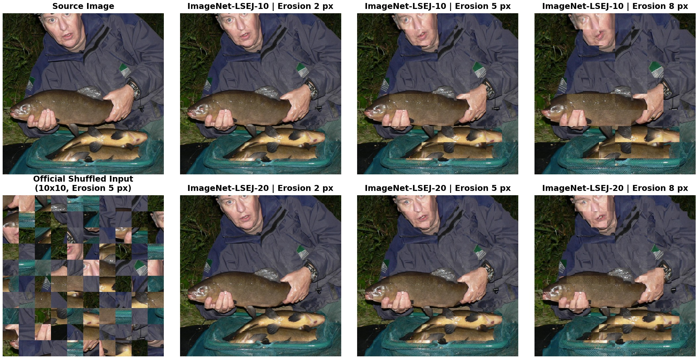

# ImageNet-LSEJ

**A Large-Scale Benchmark for Large-Grid Eroded Jigsaw Reassembly**

[](LICENSE)

ImageNet-LSEJ (ImageNet Large-Scale Eroded Jigsaw) is a controlled benchmark for evaluating jigsaw-puzzle reassembly under increasing grid size and boundary-information loss. It contains 12,000 high-resolution images selected from the [ImageNet ILSVRC2012](https://www.image-net.org/index.php) training set and defines six paired tasks by combining two grid sizes (10x10 and 20x20) with three erosion widths (2, 5, and 8 pixels).

All tasks share the same source images, official train/validation/test split, 50x50 piece resolution, and fixed piece permutations. This paired design makes it possible to study the effects of puzzle scale and erosion strength without confounding them with different images or shuffles.

## Why ImageNet-LSEJ?

Eroded jigsaw reassembly removes visual evidence around the original seams, making both local neighbor matching and global layout recovery more difficult. Existing evaluation resources tend to emphasize only one of the following dimensions:

- learning-oriented eroded-puzzle datasets provide many training samples but primarily use small 3x3 or 5x5 grids;
- classical large-grid evaluations contain hundreds or thousands of pieces but often rely on only a small number of source images.

Consequently, strong performance on small grids does not reveal whether a method remains effective as the number of pieces and candidate relationships grows. ImageNet-LSEJ is designed to cover **both a large sample size and large puzzle grids**, enabling reproducible training and controlled scalability analysis.

The following table summarizes representative resources that motivate this design. Classical benchmarks reach hundreds or thousands of pieces, but contain too few images to support modern representation learning. Learning-oriented benchmarks provide thousands of puzzles, but are concentrated at 3x3 and 5x5 grids.

| Dataset / benchmark | Data scale | Puzzle size | Eroded boundaries | Learning-oriented split |
|:--|:--|:--|:--:|:--:|
| [MIT (Cho et al.)](https://icvl.cs.bgu.ac.il/pages/researches/Square-Jigsaw-Puzzle-Solving.html) | 20 images | 432 pieces | No | No |
| [McGill](https://icvl.cs.bgu.ac.il/pages/researches/Square-Jigsaw-Puzzle-Solving.html) | 20 images | 540 pieces | No | No |
| [BGU-805](https://icvl.cs.bgu.ac.il/pages/researches/Square-Jigsaw-Puzzle-Solving.html) | 20 images | 805 pieces | No | No |
| [BGU-2360](https://icvl.cs.bgu.ac.il/pages/researches/Square-Jigsaw-Puzzle-Solving.html) | 3 images | 2,360 pieces | No | No |
| [Bridger et al.](https://openaccess.thecvf.com/content_CVPR_2020/papers/Bridger_Solving_Jigsaw_Puzzles_With_Eroded_Boundaries_CVPR_2020_paper.pdf) | 3 sets x 20 images | 70 / 88 / 150 pieces | Yes | No large-scale puzzle split |
| [Deepzzle](https://arxiv.org/abs/2005.12548) | 12,000 puzzles | 3x3 | Yes | Yes |
| [JPwLEG](https://ojs.aaai.org/index.php/AAAI/article/download/25325/25097) | 12,000 puzzles | 3x3 / 5x5 | Yes | 9,000 / 1,000 / 2,000 |
| [GAP](https://github.com/OfirShahar/puzzle-flow-matching) | 20,000 puzzles per subset | 3x3 / 5x5 | Yes, irregular | Yes |
| **ImageNet-LSEJ (ours)** | **12,000 paired source images** | **10x10 / 20x20** | **Yes, 2 / 5 / 8 px** | **9,000 / 1,000 / 2,000** |

Counts refer to source images for classical image benchmarks and to generated puzzles for learning-oriented datasets. The table is representative rather than exhaustive; protocols and boundary models differ across datasets.

<p align="center">
  
</p>

<p align="center"><em>Representative methods that perform well on 3x3 puzzles can degrade sharply at 5x5, motivating controlled evaluation at substantially larger grids.</em></p>

## Key Features

- **12,000 source images** covering 967 ImageNet classes.
- **Two grid sizes:** 10x10 (100 pieces) and 20x20 (400 pieces).
- **Three controlled erosion levels:** 2, 5, and 8 pixels removed from every side of each piece.
- **Six official tasks** and 72,000 virtual puzzle instances in total.
- **18 million virtual piece instances** across all task configurations.
- **Fixed 9,000/1,000/2,000 train/validation/test split.**
- **Official fixed permutations** shared across erosion levels of the same grid.
- **On-the-fly task generation:** source images are stored once; resizing, splitting, erosion, and shuffling are performed by the official DataLoader.

## Task Preview

All six tasks are generated from the same source image with paired permutations. Increasing erosion removes more boundary evidence, while increasing the grid from 10x10 to 20x20 raises the number of pieces from 100 to 400. The shuffled panel below shows the actual solver input; the remaining panels are restored to ground-truth order only to visualize the degradation.

<p align="center">
  
</p>

<p align="center"><em>One source image under the six official ImageNet-LSEJ task configurations.</em></p>

## Download

> **Dataset download:** [changxinye/ImageNet-LSEJ on Hugging Face](https://huggingface.co/datasets/changxinye/ImageNet-LSEJ)

Dataset files are currently being uploaded. Package checksums and complete release instructions will be added after the upload is finalized.

## Dataset Statistics

| Item | Value |
|:--|--:|
| Source dataset | ILSVRC2012 training set |
| High-resolution candidates | 13,091 images from 969 classes |
| Selected source images | 12,000 |
| Covered ImageNet classes | 967 |
| Source image size | 1000x1000 RGB |
| Training split | 9,000 images |
| Validation split | 1,000 images |
| Test split | 2,000 images |
| Piece input size | 50x50 RGB |
| Official tasks | 6 |

The split is generated with random seed 42 using an exact-size, class-stratified procedure. Each source image belongs to exactly one split.

## Official Tasks

| Task ID | Benchmark subset | Grid | Pieces | Working image | Erosion per side | Piece input |
|:--|:--|--:|--:|--:|--:|--:|
| `grid10_erode2` | ImageNet-LSEJ-10 | 10x10 | 100 | 500x500 | 2 px | 50x50 |
| `grid10_erode5` | ImageNet-LSEJ-10 | 10x10 | 100 | 500x500 | 5 px | 50x50 |
| `grid10_erode8` | ImageNet-LSEJ-10 | 10x10 | 100 | 500x500 | 8 px | 50x50 |
| `grid20_erode2` | ImageNet-LSEJ-20 | 20x20 | 400 | 1000x1000 | 2 px | 50x50 |
| `grid20_erode5` | ImageNet-LSEJ-20 | 20x20 | 400 | 1000x1000 | 5 px | 50x50 |
| `grid20_erode8` | ImageNet-LSEJ-20 | 20x20 | 400 | 1000x1000 | 8 px | 50x50 |

For a fixed grid size, all three erosion settings use the same piece permutation. Their outputs therefore differ only in boundary degradation, not in piece order.

## Source-Image Selection

ImageNet-LSEJ is derived from the [ImageNet ILSVRC2012](https://www.image-net.org/index.php) training set:

1. Select images whose shorter side is at least 1,000 pixels, producing 13,091 candidates from 969 classes.
2. Center-crop each candidate to 1000x1000 without resizing.
3. Rank the candidates by jigsaw suitability using local information content, connected low-information regions, piece-level repetition, and overall detail richness.
4. Retain the top 12,000 images, covering 967 classes.
5. Apply the fixed class-stratified 9,000/1,000/2,000 split.

This selection deliberately favors images with sufficient local structure for studying piece compatibility. ImageNet-LSEJ is therefore a controlled jigsaw benchmark rather than an unbiased sample of the full ImageNet distribution.

## Puzzle Generation

Each sample is generated dynamically by the official DataLoader:

```text
Load a 1000x1000 source image
              |
              v
10x10: resize the image to 500x500 with Lanczos
20x20: retain the original 1000x1000 image
              |
              v
Split in row-major order into 100 or 400 pieces of 50x50
              |
              v
Crop e pixels from every side of each piece
              |
              v
Resize the remaining center region back to 50x50 with Lanczos
              |
              v
Apply the official fixed permutation
```

Here, erosion means **border cropping followed by size restoration**, rather than binary morphological erosion:

```text
2-pixel erosion: 50x50 -> 46x46 -> 50x50
5-pixel erosion: 50x50 -> 40x40 -> 50x50
8-pixel erosion: 50x50 -> 34x34 -> 50x50
```

## Planned Package Layout

The released dataset package will follow this structure:

```text
ImageNet_LSEJ/
|-- images/                         # 12,000 source images
|-- splits/
|   |-- train.csv
|   |-- val.csv
|   |-- test.csv
|   |-- all.csv
|   `-- summary.json
|-- configs/
|   |-- grid10_erode2.json
|   |-- grid10_erode5.json
|   |-- grid10_erode8.json
|   |-- grid20_erode2.json
|   |-- grid20_erode5.json
|   |-- grid20_erode8.json
|   `-- tasks.json
|-- permutations/
|   |-- grid10_permutations.npz
|   |-- grid20_permutations.npz
|   `-- metadata.json
|-- examples/
|   |-- dataloader_example.py
|   `-- preview_lsej.ipynb
`-- lsej_dataloader.py
```

Source images are stored only once. The six tasks are generated on demand rather than materialized as six separate copies.

## Label Convention

Original pieces use zero-based row-major indexing. The official shuffle is defined as:

```python
shuffled_pieces = original_pieces[permutation]
```

Therefore, `permutation[i]` is the original position of shuffled piece `i`. The ground-truth layout can be restored with:

```python
restored_pieces = torch.empty_like(shuffled_pieces)
restored_pieces[permutation] = shuffled_pieces
```

Users should load the published permutation arrays instead of regenerating them from a random seed.

## Quick Start

After downloading the released package, create an official task as follows:

```python
from lsej_dataloader import ImageNetLSEJDataset

dataset = ImageNetLSEJDataset(
    root="ImageNet_LSEJ",
    split="train",
    task="grid10_erode2",
)

sample = dataset[0]
print(sample["pieces"].shape)       # [100, 3, 50, 50]
print(sample["permutation"].shape)  # [100]
```

For 20x20 tasks, `sample["pieces"]` has shape `[400, 3, 50, 50]`. By default, pieces are returned as `float32` tensors in `[0, 1]`; set `normalize=False` to receive `uint8` tensors.

The complete runnable example and visualization notebook will be provided in:

```text
ImageNet_LSEJ/examples/dataloader_example.py
ImageNet_LSEJ/examples/preview_lsej.ipynb
```

## Evaluation Protocol

ImageNet-LSEJ supports evaluation at both the local compatibility and complete-layout levels.

**Neighbor retrieval:**

- Recall@K
- mean reciprocal rank (MRR)
- mean rank

**Puzzle reassembly:**

- puzzle accuracy (PA): percentage of completely correct puzzles;
- absolute accuracy (AA): percentage of pieces placed at their exact target positions;
- spatial relation accuracy (SRA): percentage of ground-truth horizontal and vertical adjacencies recovered.

The fixed split and permutations should be preserved when comparing methods. Model selection should use the validation set, while the test set should be reserved for final evaluation.

## Scope and Data Terms

ImageNet-LSEJ models boundary-information loss in regular square-grid puzzles. It is not intended as a replacement for datasets of irregular physical or archaeological fragments.

The benchmark is derived from ILSVRC2012. See the [ImageNet website](https://www.image-net.org/index.php) for the original dataset and the [ImageNet terms of access](https://www.image-net.org/download.php). Users are responsible for complying with those terms and the rights associated with the underlying images. The final distribution format and access procedure will be documented with the download release.

## Related Project

- [RG-LNS: Reliability-Guided Large Neighborhood Search for Eroded Jigsaw Puzzle Reassembly](https://github.com/ChangxinYe/RG-LNS)

## Citation

Citation information will be added with the public paper release.

## License

The code and metadata in this repository are released under the [MIT License](LICENSE). Image content remains subject to the applicable ImageNet access terms and the rights of the original image owners.
